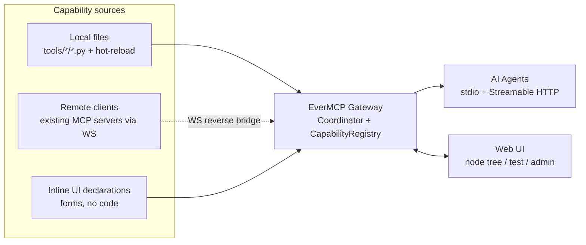

# EverMCP

[](https://github.com/wuweitianxing/EverMCP/actions/workflows/ci.yml)
[](https://www.python.org/downloads/)
[](LICENSE)
[](CHANGELOG.md)

**MCP Gateway + Capability Governance UI for AI Agents.** You write the tools;
we provide registration, security boundaries, multi-source aggregation,
and both stdio and Streamable HTTP transports.

This project **does not ship any tools**. It ships the framework, the
configuration model, and a couple of reference tools in `examples/tools/`
that you copy and adapt.

## What you get

- **Tool Registry** that auto-discovers any `tools/<category>/*.py` you
  point it at, watching for changes with hot-reload.
- **Multi-source capability aggregation**: local files + remote clients
  (WebSocket reverse-connection) + inline UI declarations, all in one place.
- **Security boundaries**: `SafePath` (filesystem allowlists) and `SafeURL`
  (SSRF defense) helpers wired into `ToolContext`.
- **Dual MCP transports**: stdio (for Claude Desktop / Claude Code / Cursor)
  and Streamable HTTP (for agents that speak HTTP).
- **Web UI**: capability tree visualization, inline declarations,
  client/key management, call logs.
- **WebSocket reverse bridge**: `evermcp-connect` lets you expose any
  existing MCP server to the gateway from behind NAT.
- **LocalWorker protocol** with typed error envelopes (codes `-32001`..`-32005`).

You bring your own tool directory.

## Why EverMCP

Most MCP setups are one server per process — you point Claude Desktop at a
single stdio command and that's it. EverMCP turns that into a **gateway**:
one entry point that aggregates capabilities from many sources, governed
through a browser UI.

| Compared to | EverMCP difference |
|---|---|
| **A bare MCP server** | Multi-client (stdio **and** HTTP), multi-source aggregation, web UI for governance — not just one process exposing one tool set. |
| **Workflow platforms (n8n / Langflow)** | Capabilities are first-class citizens (Tool/Resource/Prompt nodes), not workflow graphs. You publish primitives the Agent composes at runtime. |
| **Thin transport gateways (MCPPort)** | Adds a capability node-tree UI, inline declarations, call logging, enable/disable governance — not just a WS tunnel. |
| **The MCP Inspector** | EverMCP *publishes* capabilities to Agents; the Inspector only *debug-tests* them. |

Three capability sources, one gateway:



## Install

```bash
git clone <repo-url>
cd EverMCP
pip install -e ".[dev]"
```

Python 3.11+ required.

## Quick start

```bash
# Run with stdio MCP transport only (classic mode):
evermcp serve --tools-dir examples/tools

# Run with both stdio + HTTP + Web UI:
evermcp serve --tools-dir examples/tools --http --ui

# List tools without starting server:
evermcp list-tools --tools-dir examples/tools

# Connect an existing MCP server to the gateway:
evermcp connect --token <api-key> -- ws://127.0.0.1:8788/ws mcp-server
```

### Claude Desktop config

Add to your `claude_desktop_config.json`:

```json
{
  "mcpServers": {
    "evermcp": {
      "command": "evermcp",
      "args": ["serve", "--tools-dir", "C:/Users/you/my-mcp-tools"]
    }
  }
}
```

## Configuration

Copy `config.example.toml` to `~/.evermcp/config.toml`:

```toml
[general]
log_level = "INFO"
log_file = "~/.evermcp/evermcp.log"

[security]
filesystem_allowlist = ["~/data", "~/Downloads"]
network_allowlist   = ["github.com", "pypi.org"]
denied_paths        = ["~/.ssh", "~/.aws", "~/.config/gh"]

[gateway]
host = "127.0.0.1"
port = 8787
```

Loading order: defaults → `~/.evermcp/config.toml` → env vars (`EVERMCP_*`) → CLI flags.

## Connect a remote MCP server

Any existing stdio MCP server can be reverse-registered into the gateway
from behind NAT — the client makes an **outbound** WebSocket, so no port
forwarding is needed. The server's tools then appear alongside your local
ones under the `remote.<client_id>.<tool>` namespace.

```bash
# 1. On the gateway: create an API key with the ws:connect scope
#    (via the Web UI's admin panel, or the REST API).

# 2. On the remote machine: bridge its stdio MCP server into the gateway
evermcp-connect --gateway ws://gw.example.com/ws --token <api-key> -- \
    python -m my_mcp_server
```

The remote server's tools now appear in `tools/list` and the node tree.
Disconnects are detected via heartbeat; calls time out with `-32002` after
`remote_call_timeout_s` (default 60s) and a dropped client returns `-32003`.

## Web UI

Run `evermcp serve --http --ui` and open `http://127.0.0.1:8787/`. The UI is
the core differentiator — a **capability node tree** that visualizes every
source (local / remote / inline) grouped by category, with:

- **Node tree** (left): search, per-node enable/disable toggles, health
  badges (green = healthy, red = offline), source labels.
- **Declaration editor** (center): declare Tool / Resource / Prompt via
  forms — pure metadata, no code execution. Saved to SQLite instantly.
- **Test panel** (bottom): call any capability with arguments, see the
  result or error code without leaving the browser.
- **Admin** (right): connected remote clients, API key CRUD, call logs.

The UI is protected by a local token (cookie) and binds to `127.0.0.1` by
default. Admin endpoints (`/api/clients`, `/api/keys`, `/api/logs`) require
an `admin`-scope API key.

## Write your first tool

A tool is a plain function decorated with `@tool`. Type annotations become
the JSON Schema the AI sees; the return value must be JSON-serializable.

```python
# tools/demo/hello.py
from evermcp.core.tool import tool

@tool(description="Say hello to someone by name.")
def hello(name: str) -> dict:
    return {"message": f"hello, {name}"}
```

Drop it under `tools/<category>/<name>.py`, point `--tools-dir` at the
parent, and it shows up as `demo.hello` — hot-reloaded on every save.

For the full spec (subprocess tools, async tools, `ToolContext`, security
helpers, error envelopes), read [`docs/adding-tools.md`](docs/adding-tools.md).
The two reference tools in [`examples/tools/`](examples/tools/) are ready to
copy: [`demo/hello.py`](examples/tools/demo/hello.py) and
[`io/read_file.py`](examples/tools/io/read_file.py).

## Project structure

```
EverMCP/
├── evermcp/               # framework
│   ├── core/             # @tool decorator, ToolRegistry, ToolContext
│   ├── workers/          # LocalWorker, error envelope
│   ├── protocol/         # Coordinator + MCP stdio server + HTTP server + WS channel + REST API
│   ├── security/         # SafePath, SafeURL, Config, auth
│   ├── web/              # FastAPI Web UI
│   ├── connect/          # stdio-ws bridge (evermcp-connect)
│   └── cli.py            # `evermcp serve` / `evermcp list-tools` / `evermcp connect`
├── examples/
│   └── tools/            # 2 reference tools — copy these to start
│       ├── demo/hello.py
│       └── io/read_file.py
├── docs/
│   ├── adding-tools.md   # full tool-authoring spec
│   ├── DESIGN.md         # historical design (archived)
│   └── reviews/          # S0/S1/S2 reviews (archived)
├── tests/                # unit / worker / registry / e2e / integration / security
├── tools/                # empty by default — point --tools-dir here for your tools
├── config.example.toml
├── CHANGELOG.md          # release history
├── SECURITY.md           # v0.3.0 security model
└── pyproject.toml
```

## CLI

```
evermcp serve [--tools-dir PATH] [--stdio/--no-stdio] [--http/--no-http]
              [--host HOST] [--port PORT] [--ui/--no-ui] [--init-db/--no-init-db]
              # start MCP server (stdio and/or HTTP transport)
evermcp list-tools [--tools-dir PATH]  # print registered tools, exit
evermcp connect --token TOKEN -- GATEWAY_WS_URL SERVER_COMMAND
              # connect a local MCP server to the gateway
evermcp --help
evermcp --version
evermcp -v serve ...                    # enable DEBUG logging
evermcp -c /path/to/config.toml serve   # custom config file
```

## Error envelopes

Tool failures are wrapped into JSON-RPC error codes so the AI (and your
client code) can react programmatically. `ToolContext` injects `SafePath` /
`SafeURL` so security violations surface as `-32005` rather than a crash.

| Code | Meaning | Triggered when |
|---|---|---|
| `-32001` | `TOOL_NOT_FOUND` | AI calls a non-existent tool |
| `-32002` | `TOOL_TIMEOUT` | Tool raises with "timeout" in the message, or a remote call exceeds `remote_call_timeout_s` |
| `-32003` | `TOOL_EXCEPTION` | Tool raises any other `Exception` (incl. remote `isError: true`) |
| `-32004` | `TOOL_INVALID_OUTPUT` | Tool returns a non-JSON-serializable value |
| `-32005` | `SECURITY_VIOLATION` | Tool raises `SecurityViolation` (SafePath / SafeURL rejection) |

See [`SECURITY.md`](SECURITY.md) for the full trust-boundary model and the
tool-author security checklist.

## Roadmap

EverMCP ships in gradient stages — each independently usable and backward
compatible with the `@tool` contract.

| Stage | Status | Delivers |
|---|---|---|
| **S0** Skeleton | ✅ Done | Capability model (Tool/Resource/Prompt), dual transport (stdio + HTTP), SQLite base |
| **S1** Core | ✅ Done | Capability node-tree UI, inline declarations, local token auth |
| **S2** Useful | ✅ Done | Reverse server registration (WS), API key auth, call logs |
| **S3** Polish | ⬜ Deferred | BM25 retrieval, version/audit queue, SSRF hardening (optional, non-blocking) |

Full plan and stage reviews live in [`docs/gateway-plan.md`](docs/gateway-plan.md)
and [`docs/reviews/`](docs/reviews/).

## Versioning

- Python: 3.11+ (uses `datetime.UTC`, `tomllib`, PEP 695 generics)
- EverMCP: see [`pyproject.toml`](pyproject.toml) (`version = "0.3.0"`) —
  changes tracked in [`CHANGELOG.md`](CHANGELOG.md)

## License

MIT — see [`LICENSE`](LICENSE).