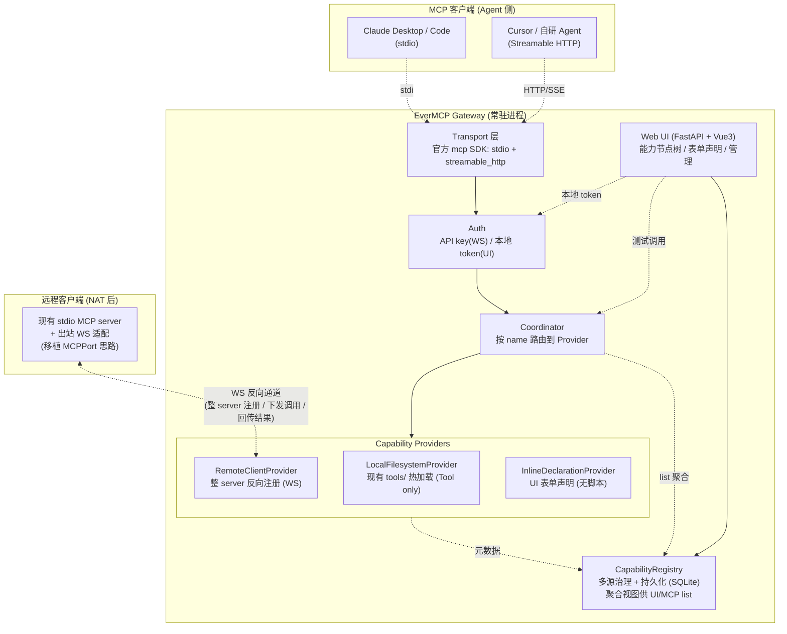

# EverMCP v3 网关化计划 (Gateway + Capability Governance UI)

> Status: 进行中 — S0/S1/S2 已完成,S3 暂缓
> 日期: 2026-06-30 (初稿) / 2026-06-30 (修订:落实复用决策 + 梯度规划) / 2026-07-01 (进度更新:S0+S1 落地) / 2026-07-02 (S2 完成 + 命名规范修正 SEP-986)
> 上游设计: `DESIGN.md` (v0.2.0,已归档)、`SECURITY.md` (v0.3.0)
> 配套文档: `competitive-analysis.md`(竞品调研)、`architecture-reflection.md`(架构反思)、`reviews/`(阶段审查与实施总结归档)
> 模式: Builder / 自定节奏

---

## 0. TL;DR

把 EverMCP 从「本地单进程工具框架」演进为「**MCP 网关 + 能力治理可视化平台**」。差异定位(经竞品调研验证,**无直接竞品**):

> **EverMCP = 以 MCP 能力为一等公民的低代码发布台 + 聚合网关**
> 区别于工作流平台(n8n/Langflow/Flowise 以工作流图为一等公民)、薄 transport 网关(MCPPort 无编排)、调试器(Inspector 只测不发布)。

三大支柱:

1. **MCP 网关** — 多客户端可连接(stdio + Streamable HTTP),**聚合层直接复用官方 `mcp` SDK 的 `ClientSessionGroup`**(不自建),Agent 通过单一 MCP 入口访问所有来源能力。
2. **客户端整 server 反向注册** — 远程客户端把现有 MCP server 经出站 WebSocket 反向接入网关(NAT 穿透,**思路移植自 MCPPort**)。**不做单能力声明式发布 SDK**(对使用者过度复杂)。
3. **能力节点树 UI** — 浏览器里可视化网关所有能力(按来源/类别分组 + 搜索 + 启停 + 健康徽标),表单式声明 Tool/Resource/Prompt。**这是核心独创卖点**。

**复用 vs 自建边界**(详见 `architecture-reflection.md`):
- 复用:官方 `mcp` SDK(transport + session_group 聚合)、MCPPort 的 WS 反向思路、Vue3/Element Plus(MIT)。
- 自建:多源 CapabilityRegistry + 治理、能力节点树 UI、LocalFilesystemProvider(v0.2.0 已有)。
- 砍除:gRPC worker 层、单能力发布 SDK(初期)、持久化远程能力、BM25 检索(S3 可选)、**Monaco 脚本编辑器 + 沙箱**(本地 IDE + 文件热加载已够)。

工程顺序按 **骨架(S0) → 核心(S1) → 有用(S2) → 无关紧要(S3)** 梯度(见 §6),每阶段可独立验证、向后兼容 v0.2.0 的 `@tool` 契约。

**进度总览**(2026-07-02):

| Stage | 状态 | 规模(估/实) | 测试 | 说明 |
|---|---|---|---|---|
| S0 骨架 | ✅ 完成 | ~630 / ~890行 | 238 passed | 能力泛化 + 双 transport + SQLite 基座;经审查修复 11 项 |
| S1 核心 | ✅ 完成 | ~1010 / ~960行 | 255 passed | 节点树 UI + 表单声明 + token 鉴权;经审查修复 11 项 |
| S2 有用 | ✅ 完成 | ~860行 | 267 passed | 整 server 反向注册 + 认证 + 日志;命名规范修正 SEP-986 |
| S3 无关紧要 | ⬜ 暂缓 | ~630行 | — | 打磨(按需) |

阶段审查与实施总结归档于 `docs/reviews/`。S0-S2 全部完成;下一阶段:S3(暂缓,按需)。

---

## 1. 背景与目标

### 1.1 当前定位 (v0.2.0)
> 「You write the tools; we provide the registration, security boundary, and stdio transport.」

单进程、单 stdio 客户端、本地文件系统扫描工具、无 UI、无远程发布。架构按「Coordinator + Worker」分层,为多设备/多客户端预留了接口但未实现。

### 1.2 v3 目标
> 「客户端自行声明能力 → 发布到网关 → Agent 通过 MCP 访问;Web UI 低代码编排能力节点树。」

- **网关化**:一个常驻服务,聚合来自「本地文件 / 远程客户端 / 内联声明」的能力,作为统一 MCP server 对外。
- **低代码**:非 Python 开发者也能在 UI 里声明资源、写提示,即时发布给 Agent。
- **节点树可视化**:把网关内所有能力按来源/类别组织成树,可发布、查看、启停、测试。

---

## 2. 现状评估 (v0.2.0)

### 2.1 已具备(可直接复用)
| 能力 | 实装位置 | 复用价值 |
|---|---|---|
| `@tool` 装饰器 + 类型注解→JSON Schema | `evermcp/core/tool.py` | 高:能力模型泛化的基座 |
| ToolRegistry + watchdog 热加载 | `evermcp/core/registry.py`, `watcher.py` | 高:作为 LocalFilesystemProvider |
| Coordinator + LocalWorker (in-process) | `evermcp/protocol/coordinator.py`, `workers/local.py` | 中:需扩成多 Provider/多 Worker |
| MCP stdio server (官方 SDK) | `evermcp/protocol/mcp_server.py` | 高:加 HTTP transport 的参照 |
| SafePath / SafeURL + 错误信封 (-32001..-32005) | `evermcp/security/*` | 高:网关化安全基座 |
| 配置分层 (TOML→env→CLI) | `evermcp/security/config.py`, `cli.py` | 高:扩展配置项即可 |
| 测试分层 (unit/worker/registry/e2e/integration/security) | `tests/` | 高:网关化新功能照此分层 |
| 真实工具已落地 | `tools/{http,io,media,tts,ctxcheck}` | 高:回归基线 |

### 2.2 v0.2.0 的设计前提(对网关化是硬限制)
| 前提 | 网关化的冲突 |
|---|---|
| 仅 stdio transport | stdio 一对一,无法多客户端/远程连接;Web UI 也需 HTTP |
| 仅 Tools(MCP 三原语之一) | 目标要支持 Resource / Prompt |
| 工具来源 = 本地文件扫描 | 目标要支持远程客户端发布 + UI 内联声明 |
| 单 LocalWorker,in-process | 目标要多来源聚合 + 反向调用客户端 |
| 无持久化(配置在 TOML,状态在内存) | 发布的能力、客户端、API key 需持久化 |
| 无认证(假设本地用户) | 远程客户端发布必须鉴权 |
| 无 UI | 目标核心 |

**结论**:v0.2.0 的「Coordinator + Worker + Registry + 安全」骨架是对的,网关化是**在其上扩展**而非重写。最大缺口在 transport、能力模型泛化、Provider 抽象、持久化、UI 五处。

---

## 3. 差距分析(修订版:含复用/砍除决策)

| 维度 | v0.2.0 | v3 目标 | 差距 / 决策 |
|---|---|---|---|
| Transport | stdio | stdio + Streamable HTTP(SSE) | **复用官方 `mcp` SDK**,新增 `http_server.py` |
| 能力类型 | Tool | Tool + Resource + Prompt | 自建数据模型泛化;**本地文件扫描仍只针对 Tool** |
| 能力来源 | 本地文件 | 本地文件 + 远程整 server + UI 内联声明 | Provider 接口 + 3 实现 |
| 聚合层 | 内存 dict,单源 | 多源聚合 | **复用官方 `ClientSessionGroup`**,不自建聚合传输 |
| 注册表 | 内存 | 多源治理 + 持久化 | 自建 `CapabilityRegistry`(治理,非聚合传输) |
| Worker | 单 LocalWorker | Local + Remote(WS 反向) | **WS 反向通道思路移植自 MCPPort**;砍 gRPC |
| 客户端发布 | 无 | 整 server 反向注册 | **不做单能力发布 SDK**(改 MCPPort 式整 server) |
| 认证 | 无 | API key(WS)+ 本地 token(UI) | 自建 auth 中间件 |
| 持久化 | TOML | clients/keys + 内联声明 + 日志 | SQLite + SQLModel;**远程能力只在内存** |
| UI | 无 | 能力节点树 + 表单声明 + 管理 | 自建核心(纯声明,无代码编辑) |
| 脚本执行 | 文件即工具 | 无(本地 IDE + 热加载已够) | **砍除 Monaco 脚本沙箱**;本地文件热加载即开发通道 |
| 工具检索 | 无 | 无(初期能力 <50) | **砍除**,S3 可选借鉴 mcpproxy-go |

---

## 4. 目标架构



**关键流向**:
- **Agent 调用**:`Agent → Transport(官方 SDK) → Auth → Coordinator → 按 name 选 Provider → 执行 → 回传`。本地工具进程内执行;远程工具经 WS 下发。
- **能力列表聚合**:`Coordinator.list_*()` 遍历各 Provider 的 `list_capabilities()`,合并去重 + 命名空间前缀,返回给 MCP `tools/resources/prompts list` 与 UI 树。**传输层聚合用官方 SDK;Provider 间聚合是 CapabilityRegistry 的职责。**
- **客户端整 server 反向注册**:`远程客户端启动 stdio MCP server + 出站 WS 连网关 → 网关侧 RemoteClientProvider 桥接为本地可用 server → 其工具出现在节点树`。客户端**不改业务代码**,只加 WS 适配层。
- **远程调用**:`Coordinator → RemoteClientProvider → WS 下发 {call_id, tool, args} → 客户端本地执行 → WS 回传`。掉线/超时 → `-32002/-32003`。
- **UI 编排**:`浏览器 → FastAPI(本地 token)→ Registry(读写声明/启停) / Coordinator(测试调用)`。

**与初稿的关键差异**:
- 聚合传输由官方 `ClientSessionGroup` 承担,`CapabilityRegistry` 只做治理(持久化/启停/可见性),不再做传输聚合。
- `RemoteClientProvider` 注册粒度是**整 server**(MCPPort 式),非单能力。
- `InlineDeclarationProvider` 仅表单声明(无脚本),不引入脚本沙箱。

---

## 5. 核心设计决策(含技术实现细节)

> 本节是审核重点。每条决策给出:设计要点、数据结构/接口签名、协议/格式、依赖、与复用方案的关系。

### 5.1 能力模型泛化:Tool → Capability (Tool/Resource/Prompt)

对齐 MCP 三大原语。保留 `@tool` 向后兼容;新增 `@resource`、`@prompt`。**本地文件扫描仍只针对 Tool**;Resource/Prompt 来自 UI 声明或远程。

```python
# evermcp/core/capability.py (新增)
from enum import Enum
from typing import Literal, Protocol

class CapabilityKind(str, Enum):
    TOOL = "tool"
    RESOURCE = "resource"
    PROMPT = "prompt"

class Capability(Protocol):
    """所有能力的统一接口。各 Provider 返回实现此接口的对象。"""
    kind: CapabilityKind
    name: str          # 含命名空间前缀,如 "local.io.read_file"
    source: str        # "local" | "remote.<client_id>" | "inline"
    description: str
    enabled: bool
    def descriptor(self) -> dict: ...   # 对应 MCP 的 Tool/Resource/ResourceTemplate/Prompt
    def call(self, args: dict, ctx: ToolContext | None) -> Any: ...  # tool 调用;resource/prompt 用 read/get
```

- `@tool` 装饰器:**不变**,现有 `ToolFunc` 实现 `Capability` 接口(加 `kind=TOOL`)。
- `@resource(uri=..., description=...)`、`@prompt(description=...)`:新装饰器,仅在 UI/远程场景用,本地文件不扫描。
- `CapabilityRegistry` 统一管理三类,按 `kind` 分桶;MCP server 增加 `resources/list`、`resources/read`、`prompts/list`、`prompts/get` handler。
- **命名空间**:`<source>.<name>`(如 `local.io.read_file`、`remote.bot-1.search`),分隔符用 `.` 以符合 MCP SEP-986 工具名规范(仅允许 `[A-Za-z0-9._-]`,不允许 `:`)。`local.` 可省略保持 v0.2.0 兼容(AI 旧调用 `io.read_file` 仍有效)。

### 5.2 Transport 双轨:stdio + Streamable HTTP(复用官方 SDK)

- **stdio 保留**:Claude Desktop 等零迁移。现有 `mcp_server.py` 不变。
- **Streamable HTTP 新增**:用官方 `mcp` SDK 的 `streamable_http` transport。

```python
# evermcp/protocol/http_server.py (新增)
# 依赖:mcp>=1.0.0(已有),用其 streamable_http_app / streamable_http_server
from mcp.server.streamable_http import StreamableHTTPServerTransport
# Coordinator 同时挂载到 stdio Server 与 HTTP transport,共用一套 handler
```

- CLI:`evermcp serve [--stdio] [--http --host H --port P] [--ui]`。默认 stdio;`--http` 启 HTTP(可与 stdio 共存,两个事件循环或单 loop 多 task)。
- **不自建聚合层**:若将来需要聚合上游 MCP server,用官方 `ClientSessionGroup`;当前 v3 各 Provider 是进程内对象,无需 session_group。

### 5.3 能力来源:Provider 抽象

```python
# evermcp/core/provider.py (新增)
class CapabilityProvider(Protocol):
    source: str                              # "local" | "remote.<id>" | "inline"
    def list_capabilities(self) -> list[Capability]: ...
    def get(self, name: str) -> Capability | None: ...
    async def call(self, name: str, args: dict, ctx: ToolContext | None) -> Any: ...
    def health(self) -> bool: ...            # 节点树健康徽标用
```

三个实现:
- **LocalFilesystemProvider** — 现有 `ToolRegistry` 逻辑迁入(`scan()` + watchdog),保持 `tools/<category>/<name>.py` 热加载。**只扫描 Tool**。
- **RemoteClientProvider** — 见 5.4。每个反向注册的客户端一个实例。
- **InlineDeclarationProvider** — UI 表单声明的能力(无脚本),存 DB,纯元数据。

Coordinator 持有 `list[CapabilityProvider]`,`call_tool` 按 `name` 前缀路由到对应 Provider。

### 5.4 远程客户端整 server 反向注册:WebSocket(移植 MCPPort 思路)

**决策**:客户端把**现有 stdio MCP server** 经出站 WS 反向接入网关,而非改造代码发布单能力。NAT 后客户端主动出站长连。

```python
# evermcp/protocol/ws_channel.py (新增)
# 依赖:websockets>=12.0 或 starlette WebSocket(FastAPI 已含)
# 移植自 MCPPort (MIT) 的 WS 隧道 + Bearer 鉴权,解耦隧道与 MCP 路由
```

**连接生命周期**:
1. 客户端用 API key 建立 WS:`ws://gateway/ws?token=<api_key>`。
2. 网关校验 key → 生成 `client_id` → 创建 `RemoteClientProvider` 实例 → 注入 `ClientSession`(官方 SDK)桥接 WS↔MCP。
3. 客户端侧:本地 `subprocess` 起 stdio MCP server,WS 适配层把 stdio JSON-RPC 双向桥接到 WS。
4. 网关侧 `RemoteClientProvider` 通过 `ClientSession.list_tools()` 发现能力,出现在节点树(source=`remote.<client_id>`)。

**调用流向**:`Coordinator.call("remote.bot-1.search", args) → RemoteClientProvider → ClientSession.call_tool → WS 下发 JSON-RPC → 客户端 stdio server 执行 → 回传`。

**消息格式**:沿用 MCP JSON-RPC 2.0(WS 只承载 stdio 等价的 JSON-RPC 帧,不另造协议)。掉线检测靠心跳 ping/pong(30s);调用超时新增 `remote_call_timeout_s`(默认 60s)→ `-32002`;客户端异常/掉线 → `-32003`。

**客户端适配器**(轻量,非完整 SDK):
```
evermcp/connect/  # 新增,~200 行
  stdio_ws_bridge.py  # 启动 stdio MCP server + 出站 WS 桥接
  # 用法:evermcp-connect --gateway ws://gw/ws --token K -- <mcp-server-cmd>
```

### 5.5 持久化:SQLite + SQLModel(远程能力只在内存)

- 单文件、零运维。SQLModel(Pydantic v2 + SQLAlchemy)与现有风格一致。
- **远程能力不持久化**:在线即注册、离线即从 Registry 移除。只持久化客户端身份与 key,避免脏数据。

**表设计**:
```python
# evermcp/storage.py (新增),依赖:sqlmodel>=0.0.16
class Client(SQLModel, table=True):           # 反向注册的客户端身份
    id: str = Field(primary_key=True)         # client_id
    name: str
    created_at: datetime
    last_seen_at: datetime | None

class ApiKey(SQLModel, table=True):
    key_hash: str = Field(primary_key=True)   # 存 hash 不存明文
    client_id: str | None                      # 绑定客户端(可选)
    scopes: str                                # "ws:connect" 等,逗号分隔
    created_at: datetime
    revoked: bool = False

class InlineCapability(SQLModel, table=True): # UI 表单声明的能力
    id: str = Field(primary_key=True)
    kind: str                                  # tool/resource/prompt
    name: str                                  # 不含 source 前缀
    source: str = "inline"
    description: str
    schema_json: str                           # input_schema / uri_template / arguments
    enabled: bool = True
    updated_at: datetime

class CallLog(SQLModel, table=True):           # S2 引入
    call_id: str = Field(primary_key=True)
    name: str; source: str; success: bool
    started_at: datetime; duration_ms: int
    error_code: int | None
```

- LocalFilesystemProvider 以**文件**为真相源,DB 不存其能力(节点树直接读 Provider 内存)。
- 启动时:加载 `InlineCapability` 表 → 构建 `InlineDeclarationProvider`;`Client`/`ApiKey` 用于 WS 握手校验。

### 5.6 低代码 Web UI:能力节点树为核心

**技术栈**:FastAPI(`fastapi`、`uvicorn[standard]`)+ Vue3 ESM(CDN,零构建)+ Element Plus(CDN)。
- 优点:无 npm 构建链,`pip install` 即用;前端静态文件由 FastAPI 托管,单进程。
- 平滑迁移:复杂度上升可切 Vite + Vue3,产物交 FastAPI 静态托管。
- **不引入 Monaco/脚本编辑器**:能力声明走表单,纯元数据;代码编辑用本地 IDE(文件热加载)。

**UI 四块**(核心是节点树,非脚本编辑器):
1. **能力节点树**(左,**核心卖点**):按 `来源(local/remote.*/inline) → 类别 → 能力` 分组树;搜索框;每节点启停开关 + 健康徽标(绿/黄/红 = 健康/降级/离线)+ 来源标签。
2. **声明编辑器**(中):Tool/Resource/Prompt 的**表单式**声明(name、description、参数 schema 可视化编辑——字段名/类型/约束表格)。纯元数据,无代码执行。保存即落 `InlineCapability` 表。
3. **调用测试面板**(中下):选中任一能力 → 填参数 → 调用 → 看结果/错误码。复用 Coordinator 测试通道。
4. **管理**(右/顶):反向客户端列表(在线状态)、API key 增删、调用日志(S2)、配置查看。

**节点树数据模型**(后端聚合,前端只渲染):
```python
# GET /api/tree 响应
{
  "groups": [
    {"source": "local", "label": "本地文件", "children": [
      {"category": "io", "children": [
        {"name": "local.io.read_file", "kind": "tool", "enabled": true, "health": "healthy"}
      ]}
    ]},
    {"source": "remote.bot-1", "label": "bot-1 (在线)", "children": [...]}
  ]
}
```

### 5.7 认证

- **远程客户端 WS 发布**:API key(WS 握手 `?token=` 或 header `X-EverMCP-Key`),存 hash,可吊销。`[security]` 段或 DB 管理。
- **Web UI**:本地 token(首次启动生成随机串,浏览器 cookie),默认仅监听 `127.0.0.1`;若暴露外网再加完整登录。
- **Agent MCP 调用**:stdio 不鉴权;HTTP 端点可选 API key(配置开关 `http_require_key`,默认 false 本地)。

### 5.8 内联脚本沙箱(已砍除)

**决策**:不做浏览器内联脚本编辑器与沙箱。理由:
- 本地 IDE(VS Code)+ 文件热加载(v0.2.0 已有)体验远好于浏览器写 Python,是更优开发通道。
- 沙箱是高风险高成本项(RestrictedPython 是 AST 改写非进程隔离,真安全需容器隔离),投入产出比低。
- UI 能力声明走**表单式纯元数据**(`InlineDeclarationProvider`),无代码执行,无沙箱风险。
- 需要新增能力时:本地写 `.py` 文件 → 文件热加载自动注册;或 UI 表单声明元数据。

### 5.9 复用决策依据(协议已核实,见 `architecture-reflection.md`)

| 复用项 | 来源 | 协议 | 用法 |
|---|---|---|---|
| MCP transport + 聚合 | 官方 `mcp` SDK | MIT | 直接依赖,`session_group` 备用 |
| WS 反向通道思路 | MCPPort | MIT | 移植改造(解耦隧道与路由) |
| 节点编辑器 | — | — | 用 Element Plus Tree(树),不引入 React Flow |

**不得嵌入**(仅设计参考):n8n(Sustainable Use)、Dify(Modified Apache)。

---

## 6. 工程优先级与梯度规划

> **复杂度**: S<1人天 / M 1-3人天 / L 3-7人天 / XL >7人天(业余节奏)。**规模**: 代码行数估算(不含测试)。
> 工程顺序按 **骨架 → 核心 → 有用 → 无关紧要** 梯度,而非功能 Phase 顺序。
> 核心思路:用最小骨架把网关立起来,尽早做出差异化卖点(能力节点树 UI)验证价值,再补能力来源扩展,最后打磨。每个 Stage 结束必须:测试分层补齐 + 向后兼容不破。

### 6.1 复杂度与规模总表

> 状态图例:✅ 已完成(S0/S1) / ⏳ 待开工(S2) / ⬜ 暂缓(S3)。各任务行状态见对应 Stage 标题与 §0 进度总览。

| 任务 | 模块 | 复杂度 | 规模(行) | 前置依赖 | 梯度 |
|---|---|---|---|---|---|
| Capability 模型泛化(`@resource`/`@prompt`) | `core/capability.py` | M | ~120 | — | S0 骨架 |
| LocalFilesystemProvider(迁入现有 registry) | `core/provider.py` | S | ~60 | Capability | S0 骨架 |
| CapabilityRegistry 多源聚合 | `core/registry.py` | M | ~100 | Provider | S0 骨架 |
| Coordinator 多 kind 路由 | `protocol/coordinator.py` | M | ~80 | Registry | S0 骨架 |
| MCP resources/prompts handler | `protocol/mcp_server.py` | M | ~90 | Coordinator | S0 骨架 |
| HTTP transport(复用官方 SDK) | `protocol/http_server.py` | S | ~50 | mcp SDK | S0 骨架 |
| CLI flag 扩展(`--http`) | `cli.py` | S | ~30 | — | S0 骨架 |
| SQLite 基座 + `InlineCapability` 表 | `storage.py` | M | ~80 | sqlmodel | S0 骨架 |
| `[gateway]` 配置段 | `security/config.py` | S | ~20 | — | S0 骨架 |
| InlineDeclarationProvider | `core/provider.py` | S | ~50 | storage | S1 核心 |
| Web app + 本地 token 鉴权 | `web/app.py` | M | ~100 | fastapi | S1 核心 |
| REST API(树/CRUD/测试调用) | `web/rest.py` | L | ~180 | Coordinator | S1 核心 |
| 前端(节点树+表单+测试面板) | `web/static/` | XL | ~600 | Vue/Element | S1 核心 |
| CLI `--ui` 挂载 | `cli.py` | S | ~20 | web | S1 核心 |
| 启停/可见性治理(内存标记) | registry/coordinator | M | ~60 | — | S1 核心 |
| API key 认证中间件 | `security/auth.py` | M | ~90 | storage | S2 有用 |
| WS 反向通道端点 | `protocol/ws_channel.py` | L | ~200 | auth,fastapi | S2 有用 |
| RemoteClientProvider(ClientSession over WS) | `core/provider.py` | L | ~150 | mcp SDK | S2 有用 |
| 客户端适配器 `evermcp-connect` | `connect/stdio_ws_bridge.py` | L | ~200 | websockets | S2 有用 |
| REST 客户端/key 管理 | `protocol/rest_api.py` | M | ~120 | auth | S2 有用 |
| 调用日志 `CallLog` + UI 查询 | storage + web | M | ~100 | — | S2 有用 |
| 多 Provider 健康路由 | coordinator | M | ~80 | — | S3 无关紧要 |
| 能力版本/审核队列 | storage+web | L | ~200 | — | S3 无关紧要 |
| BM25 工具检索(元工具) | core + 元工具 | M | ~120 | rank_bm25 | S3 无关紧要 |
| SafeURL DNS 复检(闭合 SSRF) | `security/safeurl.py` | S | ~30 | — | S3 无关紧要 |
| 文档 v3(DESIGN/deploy/connect) | `docs/` | M | — | — | S3 无关紧要 |

**规模汇总**: S0 骨架 ~630行(实~890)✅ / S1 核心 ~1010行(实~960)✅ / S2 有用 ~860行 ⏳ / S3 无关紧要 ~630行(可选)⬜。

### 6.2 梯度原则与重排理由

- **S0 骨架** ✅:让网关「立起来」的最小闭环。能力模型泛化 + 双 transport + 持久化基座。完成后:本地工具经 stdio/HTTP 暴露,支持 Tool/Resource/Prompt 三类。无 UI、无远程。
- **S1 核心** ✅:差异化卖点,尽早验证价值。能力节点树 UI + 表单声明。完成后:浏览器可视化+声明能力。**无远程客户端也能体现核心价值**(本地工具 + 内联声明已足够展示节点树)。
- **S2 有用** ⏳:扩展能力来源与可观测性。整 server 反向注册 + 认证 + 治理持久化 + 日志。完成后:远程客户端接入,多源节点树完整。
- **S3 无关紧要** ⬜:打磨与可选增强。BM25、版本/审核、SSRF 强化。按需做,非阻塞。

**关键重排(相对原功能 Phase 顺序)**:
- **UI(核心)从原 Phase 3 前移到 S1** — UI 是差异化卖点,应尽早做出验证;本地工具 + 表单声明已能体现节点树价值,不必等反向注册。
- **反向注册(有用)从原 Phase 2 后移到 S2** — 它是「能力来源扩展」,延后不影响核心卖点验证;且其复杂度高(L×4),放在核心验证之后更稳。
- **BM25/版本/审核/SSRF 归入 S3** — 初期能力数 <50 无需检索;审核/灰度为生产打磨。
- **Monaco 脚本沙箱砍除** — 本地 IDE + 热加载已是更优开发通道;UI 声明走表单纯元数据,无需脚本执行。

---

### S0 — 骨架:能力泛化 + 双 transport + 持久化基座 ✅(已完成 2026-07-01)
**目标**:不破坏 v0.2.0 行为,泛化能力模型到三类,上线 HTTP transport(复用官方 SDK),搭 SQLite 基座。完成后网关可被多 transport 客户端访问。

**任务清单**:
- [x] `evermcp/core/capability.py`:`CapabilityKind` 枚举、`Capability` Protocol、`@resource`/`@prompt` 装饰器;`ToolFunc` 加 `kind=TOOL`。 **[M]**
- [x] `evermcp/core/provider.py`:`CapabilityProvider` Protocol + `LocalFilesystemProvider`(迁入现有 `registry.py`,**只扫 Tool**)。 **[S]**
- [x] `evermcp/core/registry.py` → `CapabilityRegistry`:按 `kind` 分桶聚合多 Provider;`ToolRegistry` 保留作别名。 **[M]**
- [x] `evermcp/protocol/coordinator.py`:持有 `list[CapabilityProvider]`,暴露 `list_tools/resources/prompts` + `read_resource/get_prompt`;`call_tool` 按 name 前缀路由。 **[M]**
- [x] `evermcp/protocol/mcp_server.py`:增加 `resources/*`、`prompts/*` handler。 **[M]**
- [x] `evermcp/protocol/http_server.py`:官方 `streamable_http`,与 stdio 共用 handler。 **[S]**
- [x] `evermcp/cli.py`:`serve [--stdio] [--http --host H --port P]`。 **[S]**
- [x] `evermcp/storage.py`:SQLModel + SQLite,建 `InlineCapability` 表。 **[M]**
- [x] `evermcp/security/config.py`:`[gateway]` 段(host/port/http_require_key)。 **[S]**
- [x] 测试:`tests/unit/test_capability.py`、`tests/integration/test_http_server.py`;回归 `test_hello.py`、`test_read_file.py` 全绿。 **[M]**

**验收**:
- `evermcp serve --tools-dir tools` 行为与 v0.2.0 完全一致(stdio),旧调用名 `io.read_file` 仍有效。
- `evermcp serve --http --port 8787` 后,官方 MCP Inspector 能 `tools/list`、`tools/call`、`resources/list`、`prompts/list`。
- `examples/tools/` 加一个 `@resource`/`@prompt` 示例(手动注册),MCP 能列出。

**新增依赖**:`sqlmodel>=0.0.16`。
**总规模**: ~630行(实~890行) / **总预估**: M(约 2 周) / **实际**: ✅ 已完成(2026-07-01,经审查修复 11 项)

---

### S1 — 核心:能力节点树 UI + 表单声明 ✅(已完成 2026-07-01)
**目标**:浏览器可视化网关所有能力,表单声明 Tool/Resource/Prompt 即时发布。**这是 EverMCP 核心独创卖点**(以能力为节点的注册中心式可视化,无竞品)。无远程客户端时本地工具+内联声明已能验证卖点。

**任务清单**:
- [x] `evermcp/core/provider.py:InlineDeclarationProvider`:读 `InlineCapability` 表构建能力对象(纯元数据,无代码)。 **[S]**
- [x] `evermcp/web/app.py`:FastAPI app + 本地 token 鉴权 + 静态托管前端。 **[M]**
- [x] `evermcp/web/rest.py`:`GET /api/tree`、`POST/PUT/DELETE /api/capabilities`、`POST /api/test`(`/api/clients`、`/api/keys` 移至 S2)。 **[L]**
- [x] 前端 `evermcp/web/static/`(Vue3 ESM + Element Plus,CDN):节点树(左)+ 表单声明(中)+ 调用测试(中下)+ 管理(右)。 **[XL]**
- [x] `evermcp/cli.py`:`serve --ui` 挂载 Web app(默认 `127.0.0.1`)。 **[S]**
- [x] 启停/可见性:`InlineCapability.enabled` 控制是否出现在 MCP list;本地/远程启停只内存标记。 **[M]**
- [x] 测试:`tests/integration/test_web_api.py`(17 用例);e2e 冒烟以 `serve --http --ui` 端到端手动验证替代。 **[M]**

**验收**:
- 浏览器打开 `http://127.0.0.1:8787/`,本地工具 + 内联声明两类同树展示。
- UI 表单声明 `translate(text, lang)` → 保存 → 节点树出现 `inline:translate` → Agent `tools/call inline:translate` 走声明。
- UI 启停任一能力 → MCP `tools/list` 立即反映。
- 调用测试面板能调任意能力并显示结果/错误码。

**新增依赖**:`fastapi`、`uvicorn[standard]`(S1 引入,供 S2 复用)。
**总规模**: ~1010行(实~960行) / **总预估**: L(约 3 周,前端是瓶颈) / **实际**: ✅ 已完成(2026-07-01,经审查修复 11 项)

---

### S2 — 有用:整 server 反向注册 + 认证 + 治理 + 日志 ✅(已完成 2026-07-02)
**目标**:远程客户端把现有 stdio MCP server 经出站 WS 反向接入,Agent 经网关调用;补持久化治理与调用日志。**不做单能力发布 SDK**。

**任务清单**:
- [x] `evermcp/security/auth.py`:API key 校验(hash 比对)+ WS 握手中间件。 **[M]**
- [x] `evermcp/protocol/ws_channel.py`:WS 端点(移植 MCPPort 思路),握手 → 创建 `RemoteClientProvider`;掉线移除能力。 **[L]**
- [x] `evermcp/core/provider.py:RemoteClientProvider`:官方 `ClientSession`(over WS)桥接,`list_tools`/`call_tool` 经 WS 下发 JSON-RPC。 **[L]**
- [x] `evermcp/storage.py`:加 `Client`、`ApiKey`、`CallLog` 表与 CRUD。 **[S]**
- [x] `evermcp/connect/stdio_ws_bridge.py`:客户端适配器(启动 stdio server + 出站 WS 桥接);CLI `evermcp-connect --gateway ... --token K -- <cmd>`。 **[L]**
- [x] `evermcp/protocol/rest_api.py`:`GET /api/clients`、API key CRUD、`GET /api/logs`(挂载到 web app)。 **[M]**
- [x] 调用日志:`CallLog` 持久化 + UI 查询。 **[M]**
- [x] 错误码:远程掉线/超时复用 `-32002/-32003`;新增 `remote_call_timeout_s`(默认 60s)。 **[S]**
- [x] 测试:`tests/integration/test_ws_channel.py`、`tests/e2e/test_remote_call.py`。 **[L]**

**验收**:
- 客户端 `evermcp-connect --gateway ws://gw/ws --token K -- python -m my_mcp_server`,其工具出现在 `tools/list`(名 `remote.<client_id>.<tool>`)。
- Agent `tools/call remote.bot-1.search` 经网关 → WS → 客户端执行 → 返回。
- 客户端断线 → `GET /api/tree` 标 `unhealthy`,调用返回 `-32003` 而非挂起;重连后恢复。
- 本地/远程/内联三类能力同树共存;调用日志可在 UI 查询。

**新增依赖**:`websockets>=12.0`(或用 starlette 内置)。
**总规模**: ~860行 / **总预估**: L(约 3-4 周,WS 桥接是难点) / **实际**: ✅ 已完成(2026-07-02,经审查修复 14 项 + 命名规范修正 SEP-986)

---

### S3 — 无关紧要:打磨(按需,非阻塞)⬜(暂缓)
**目标**:可选增强与生产打磨。**仅在 S0-S2 完成且验证有需求时做**;各项相互独立,可挑做。不含脚本沙箱(已砍)。

**任务清单**(各自独立):
- [ ] 多 Provider 健康路由:同能力多来源时健康度过滤 + 轮询。 **[M]**
- [ ] 能力版本/审核队列:远程/内联能力审核闸门(借 mcpproxy-go quarantine)。 **[L]**
- [ ] BM25 工具检索:`retrieve_tools(query, top_k)` 元工具,`rank_bm25` 库,能力数 >50 时启用。 **[M]**
- [ ] SafeURL DNS 复检:解析后复检 IP,闭合 DESIGN 已知 SSRF 限制。 **[S]**
- [ ] 文档 v3:`DESIGN.md` v3 章节(移除 gRPC v2 项)、`docs/gateway-deploy.md`、`docs/connect-guide.md`、`docs/adding-tools.md` 增补 Resource/Prompt。 **[M]**
- [ ] 回归:全部 v0.2.0 测试 + 真实工具(`tools/tts` 等)端到端冒烟。 **[M]**

**验收**(按做的项):
- 若做审核:远程/内联能力需审核通过才出现在 MCP list。
- `SECURITY.md` 更新网关信任边界;`DESIGN.md` 移除 gRPC v2 项。

**新增依赖**(按做的项):`rank_bm25`。
**总规模**: ~630行(全做) / **总预估**: M-L(全做约 3 周;单项 S-M 约 1 周)

---

## 7. 向后兼容策略
- `@tool` 装饰器与 `tools/<category>/<name>.py` 契约**不变**;`ToolRegistry` 名字保留(别名到 `CapabilityRegistry`)。
- 旧调用名 `io.read_file`(无 `local:` 前缀)继续有效;`local:` 前缀可选。
- `evermcp serve --tools-dir` 行为不变;`--http`/`--ui` 为**新增** flag,默认不开。
- 配置文件向后兼容:新增 `[gateway]`、`[web]` 段,旧配置照常工作。
- 错误码沿用 `-32001..-32005`,远程客户端掉线/超时复用 `-32002/-32003`,不引入新段以免破坏 AI 调用方。
- 持久化:首次启动无 DB 文件时自动建表,不影响 v0.2.0 纯 stdio 用户。

## 8. 风险与权衡
| 风险 | 缓解 |
|---|---|
| WS 反向通道复杂度(重连/顺序/超时) | 移植 MCPPort 成熟思路;复用现有错误信封语义;先单客户端 + 真实 stdio echo server 打通再扩 |
| 节点树前端工作量(S1 XL,无构建链) | Vue3 ESM + Element Plus CDN 起步;复杂度上升可平滑迁 Vite;先树后表单 |
| 内联脚本沙箱逃逸(S3 可选) | 默认不做;若做用 RestrictedPython + import 白名单;真安全需容器隔离;**不复用 n8n**(协议不允许) |
| UI 零构建方案后续变重 | Vue3 ESM 可平滑迁移 Vite;组件按需引入 |
| SQLite 并发 | 网关单进程,SQLite WAL 足够;真多写再迁 Postgres |
| 范围蔓延 | 严格按梯度交付;S3 各项独立可选,非阻塞 |

## 9. 明确不做(v3 范围控制)
- ❌ 多机分布式网关集群(单进程网关足够自用)。
- ❌ 完整多租户/RBAC(API key + 本地 token 够用)。
- ❌ Agent 运行时自写工具的「自进化」逻辑(DESIGN P5 仍为 v3+ 愿景;UI 已提供人工低代码通道)。
- ❌ gRPC/跨进程 worker 序列化层(DESIGN v2 项;远程客户端走 WS 反向通道已满足,**从路线图移除**)。
- ❌ 单能力声明式发布 SDK(改 MCPPort 式整 server 反向注册;单能力由 S1 UI 提供)。
- ❌ 持久化远程能力(在线即注册、离线即移除;只持久化 clients/keys)。
- ❌ Resource/Prompt 的本地文件扫描(它们来自 UI/远程)。
- ❌ 自建 MCP 聚合传输层(用官方 `ClientSessionGroup`)。
- ❌ Monaco 内联脚本编辑器 + 沙箱(本地 IDE + 文件热加载已够;UI 声明走表单纯元数据)。
- ❌ BM25 工具检索(初期能力 <50 无需;S3 可选)。

## 10. 建议的下一步
1. **审核本计划 + `architecture-reflection.md`**,重点确认梯度划分:
   - S0 骨架「能力泛化 + HTTP + Provider 基座」是否够最小;
   - S1 核心「能力节点树 UI + 表单声明」作为差异化关键路径是否认同;
   - S2 有用「整 server 反向注册」延后到核心之后是否认同。
2. 确认后,起手 S0 第一步:`evermcp/core/capability.py` + `CapabilityRegistry` + `LocalFilesystemProvider`,以现有 `core/tool.py`/`registry.py` 为基座重构,保证 `tests/unit/test_hello.py`、`test_read_file.py` 全绿。
3. 同步修订 `DESIGN.md`:把 v2「gRPC worker」项从路线图移除,替换为「WS 反向通道 + 官方 SDK transport」。

---

## 附录 A:依赖增量汇总
| 依赖 | 版本 | 引入阶段 | 协议 | 用途 |
|---|---|---|---|---|
| `sqlmodel` | >=0.0.16 | S0 骨架 | MIT | SQLite ORM |
| `fastapi` | >=0.110 | S1 核心 | MIT | REST + WS + 静态托管 |
| `uvicorn[standard]` | >=0.27 | S1 核心 | BSD-3 | ASGI server |
| `websockets` | >=12.0 | S2 有用 | BSD-3 | WS 反向通道(或用 starlette 内置) |

均为宽松协议,可商用嵌入。`mcp`/`pydantic`/`watchdog`/`click`/`httpx` 已在 v0.2.0。

## 附录 B:文件改动地图(预估,按梯度)
```
新增:
  evermcp/core/capability.py          # S0
  evermcp/core/provider.py            # S0(CapabilityProvider + LocalFilesystemProvider)
                                      #   S1 +InlineDeclarationProvider / S2 +RemoteClientProvider
  evermcp/protocol/http_server.py     # S0
  evermcp/storage.py                  # S0 建表基座 / S1 +InlineCapability / S2 +Client,ApiKey,CallLog
  evermcp/web/{app,rest,static/}      # S1
  evermcp/security/auth.py            # S2
  evermcp/protocol/ws_channel.py      # S2
  evermcp/protocol/rest_api.py        # S2(客户端/key/日志)
  evermcp/connect/stdio_ws_bridge.py  # S2(客户端适配器)
改动:
  evermcp/core/{tool,registry}.py     # S0(泛化,保留旧名)
  evermcp/core/watcher.py             # S0(迁入 LocalFilesystemProvider)
  evermcp/protocol/{coordinator,mcp_server}.py  # S0(多 kind handler)
  evermcp/cli.py                      # S0(--http) / S1(--ui)
  evermcp/security/config.py          # S0([gateway]) / S1([web])
不动:
  evermcp/security/{safepath,safeurl}.py  # 仅 S3 强化 SafeURL
  examples/tools/*                    # 契约不变
  tools/*                             # 用户工具不变
```

## 附录 C:工程节奏建议
- **关键路径**:S0(capability + provider + http)→ S1(节点树 UI)。这两段决定「网关 + 差异化」能否成立。
- **可并行**:S2 的 WS 通道 / 适配器 / REST 互相独立;S3 各项完全独立。
- **可砍**:若时间紧,S3 全砍不影响核心价值;S0 的 Resource/Prompt 若不需要也可延后(先只做 Tool)。能力新增走本地文件热加载或 UI 表单声明,无需脚本沙箱。
- **里程碑**:S0 完成 = 多客户端 MCP 网关;S1 完成 = 差异化产品形态成立;S2 完成 = 多源治理平台。
